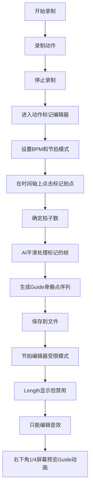

# AI动作工坊完

整实现

## 系统架构

整个AI动作工坊包含以下核心流程：




## 实现步骤

### 1. 扩展数据结构

#### 1.1 扩展 BeatPattern 类型

在 `beats/types.ts` 中添加 guide 相关字段：

- `guideFrames?: number[][]` - 每拍对应的骨骼点数据
- `totalBeats?: number` - 总拍数（标记后确定，不可修改）
- `beatFrameMapping?: number[]` - 每拍对应的原始帧索引

#### 1.2 创建 Guide 数据文件格式

在 `actions/base/types.ts` 中定义：

- `GuideData` 接口：包含平滑处理后的骨骼点序列

### 2. 增强 MocapEditor 组件

**文件**: `components/MocapEditor.tsx`修改点：

- 录制时不需要节拍器（简化录制流程）
- 录制完成后，将录制的帧数据传递给标记编辑器
- 添加"进入标记"按钮，跳转到 ActionMarkerEditor
- 移除录制时的节拍器相关代码

### 3. 新增 ActionMarkerEditor 组件

**新文件**: `components/ActionMarkerEditor.tsx`功能：

- **BPM和节拍设置**：在标记阶段确定BPM和节拍模式（用户手动设置）
- **视频时间轴显示**：显示录制的动作帧序列，支持逐帧播放
- **节拍标记工具**：
- 时间轴可拖拽浏览
- **点击时间轴标记拍点**：用户点击时间轴上的位置，标记该帧为拍点
- 显示当前标记的拍子数（标记数量）
- 可以删除/调整已标记的拍点
- 标记点可视化显示在时间轴上
- **标记确认**：完成后确定总拍数（等于标记的拍点数量）
- **调用AI平滑处理**：将标记的帧对应的骨骼点序列发送给 Gemini
- **保存guide数据**：调用 `/api/save-guide` 接口，保存BPM、总拍数、guide数据

UI布局：

- 左侧：视频播放器（可逐帧播放，显示当前帧的骨骼点）
- 右侧：时间轴标记工具 + BPM设置面板
- 底部：操作按钮（确认标记、AI处理、保存）

### 4. AI平滑处理服务

**文件**: `services/geminiService.ts`新增函数：

```typescript
export const smoothActionFrames = async (
  markedFrames: number[][][], // 每拍对应的骨骼点序列
  totalBeats: number
): Promise<number[][]> => {
  // 发送给Gemini进行平滑处理
  // 返回平滑后的guide帧序列
}
```


### 5. 后端API扩展

**文件**: `vite.config.ts`新增 `/api/save-guide` 接口：

- 接收 guide 数据和动作名称
- 保存为 `guide.ts` 文件到对应动作目录
- 更新 Action 文件以引用 guide 数据

### 6. 修改 ActionBeatEditor 组件

**文件**: `components/ActionBeatEditor.tsx`修改点：

- 检测动作是否有 guide 数据（通过 `BeatPattern.totalBeats` 判断）
- 如果有 guide 数据：
- **Length 选择器显示但禁用**：保持UI显示，但设置为disabled状态
- 固定 patternLength 为 `totalBeats`（不可修改）
- 显示提示："此动作拍子数已锁定，只能编辑音效"
- **右下角添加 Guide 预览窗口**：
- 固定位置：右下角
- **尺寸：1/4屏幕大小**（使用 `calc(50vw / 2)` 和 `calc(50vh / 2)` 计算）
- 显示当前动作的 Guide 动画
- **动作和节拍完美配合播放**：使用 beatStep 和 beatProgress 精确同步
- 使用现有的 Guide 组件渲染，传入guide数据中的骨骼点序列

### 7. 修改 Player 组件

**文件**: `components/Player.tsx`修改点：

- 检测动作是否有 guide 数据
- 如果有，使用 guide 数据驱动 Guide 组件
- 确保 guide 动画与节拍完美同步：
- 根据 `beatStep` 和 `beatProgress` 计算当前应显示的 guide 帧
- 在拍点切换时平滑过渡

### 8. 创建 Guide 数据加载器

**新文件**: `actions/base/guideLoader.ts`功能：

- 动态加载动作的 guide 数据文件
- 提供统一的 guide 数据访问接口

## 文件清单

### 新增文件

- `components/ActionMarkerEditor.tsx` - 动作标记编辑器
- `actions/base/guideLoader.ts` - Guide数据加载器
- `actions/{actionName}/guide.ts` - 各动作的guide数据文件（动态生成）

### 修改文件

- `components/MocapEditor.tsx` - 添加节拍器支持
- `components/ActionBeatEditor.tsx` - 添加限制和预览功能
- `components/Player.tsx` - 添加guide同步播放
- `services/geminiService.ts` - 添加平滑处理函数
- `beats/types.ts` - 扩展BeatPattern类型
- `actions/base/types.ts` - 添加GuideData类型
- `vite.config.ts` - 添加save-guide API

## 技术细节

### Guide数据格式

```typescript
interface GuideData {
  totalBeats: number; // 总拍数（标记时确定）
  framesPerBeat: number; // 每拍的帧数（用于平滑插值）
  frames: number[][][]; // 平滑后的骨骼点序列 [frame][landmark][x,y,z]
  // 格式：landmarks数组，每帧包含33个骨骼点的3D坐标
  bpm: number; // 标记时确定的BPM
  markedFrameIndices: number[]; // 用户标记的原始帧索引（用于参考）
}
```


### 节拍同步算法

在Player和ActionBeatEditor中：

```typescript
const currentFrameIndex = Math.floor(
  (beatStep + beatProgress) * framesPerBeat
);
const guideFrame = guideData.frames[currentFrameIndex];
```


### AI平滑处理提示词

发送给Gemini的提示应包含：

- 标记的原始帧序列